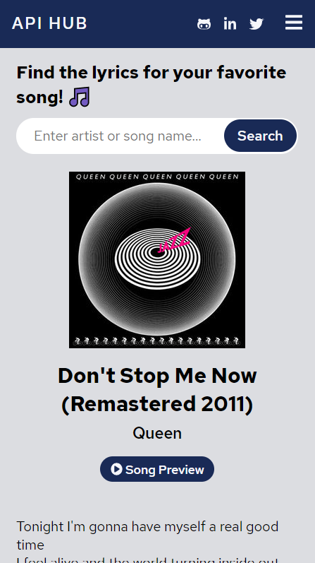
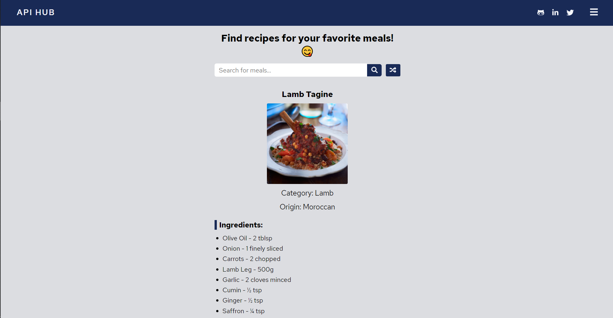

# API Hub

[Live Preview](https://jalalmallah.github.io/API-Hub/) 🚀

> The goal of creating this project is to show the ability of working with different APIs and also to group few small projects based on API into a large one insted of creating a seperate project for each API service I found interesting. This project includes a random quote generator, weather app, song lyrics finder, meal finder and exchange rates.

### Tech Stack

- React
- React Router
- Styled components

---

### Mobile View Illustration

---

### Desktop View Illustration

